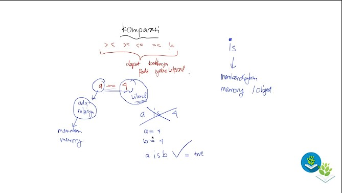
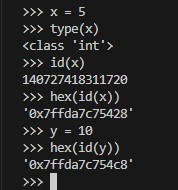
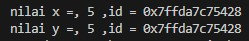

# Pertemuan10 - Operasi Komparasi (Python Tutorial)

Operasi Komparasi merupakan operasi perbandingan yang bisanya digunakan untuk membandingkan antara A dan B. Setiap hasil dari operasi komparasi adalah boolean yang berarti hanya <b>True</b> dan <b>False</b>

Berikut daftar operasi Komparasi

- `>` Lebih besar dari
- `<` Kurang dari
- `>=` Lebih besar atau sama dengan
- `<=` Kurang dari atau sama dengan
- `==` Sama dengan
- `!=` Tidak sama dengan
- `is`

## Lebih besar dari (>)

Dalam komparasi, setiap nilai menentukan posisi benar dan salah. Sebagai contoh :

```python
a = 4
b = 2

# lebih besar dari >

hasil = a > 3
print(a,'>',3,'=',hasil)
hasil = b > 3
print(b,'>',3,'=',hasil)
```

`a > 3` hasilnya akan <b>True</b>. Mengapa seperti itu? Karena posisi variabel `a` memiliki nilai yang lebih besar daripada angka 3 maka hasilnya akan benar.

Sedangkan jika `b > 3` maka hasilnya akan <b>False</b> karena posisi variabel `b` lebih rendah daripada angka 3 dan operator yang dipakai adalah lebih besar dari.

Sekarang kita coba jika nilai antar bilangan-nya sama bagaimana?

```python
hasil = b > 2
print(b,'>',2,'=',hasil)
```

Jika dijalankan, hasilnya akan <b>False</b> karena kalau menggunakan lebih besar dari harus lebih besar nilai-nya. Jika nilai-nya sama maka akan menghasilkan <b>False</b>.

Bagaimana jika seperti ini?

```python
b = 2.1

hasil = b > 2
print(b,'>',2,'=',hasil)
```

Jika dijalankan, hasilnya akan menjadi <b>True</b> karena `b` lebih besar daripada angka 2. 

## Kurang dari (<)

Sama seperti tadi, komparasi menentukan posisi benar dan salahnya.

```python
a = 4
b = 2

# kurang dari <
print('=========== kurang dari (<)')
hasil = a < 3
print(a,'<',3,'=',hasil)
hasil = b < 3
print(b,'<',3,'=',hasil)
hasil = b < 2
print(b,'<',2,'=',hasil)
```

## Lebih dari sama dengan (>=)

untuk lebih dari sama dengan ini bisa digunakan apabila semua bilangan nilai-nya sama. Sebagai contoh.

```python
a = 4
b = 2

# lebih dari sama dengan >=
print('=========== lebih dari sama dengan (>=)')
hasil = a >= 3
print(a,'>=',3,'=',hasil)
hasil = b >= 3
print(b,'>=',3,'=',hasil)
hasil = b >= 2
print(b,'>=',2,'=',hasil)
```

Lihat hasil dari `b >= 2` akan bernilai <b>True</b>. Sedangkan jika menggunakan lebih besar dari akan bernilai <b>False</b>.

## Kurang dari sama dengan (<=)

Sama seperti sebelumnya, hal diatas juga berlaku untuk kurang dari sama dengan.

```python
a = 4
b = 2

# kurang dari sama dengan <=
print('=========== kurang dari sama dengan (<=)')
hasil = a <= 3
print(a,'<=',3,'=',hasil)
hasil = b <= 3
print(b,'<=',3,'=',hasil)
hasil = b <= 2
print(b,'<=',2,'=',hasil)
```

## sama dengan (==)

Apabila menggunakan sama dengan double maka kita akan melakukan perbandingan nilai tersebut. Sedangkan sama dengan biasa itu adalah assigment.

```python
a = 4

# sama dengan ==
print('=========== sama dengan (==)')
hasil = a == 4
print(a,'==',4,'=',hasil)
```

Jika dijalankan, hasilnya <b>True</b> karena nilai 4 apakah sama dengan 4? maka benar.

Bagaimana dengan nilai `b`? Kita coba sekarang.

```python
b = 2

hasil = b == 4
print(b,'==',4,'=',hasil)
```

Hasilnya akan <b>False</b> karena nilai 2 apakah sama dengan 4? jawaban-nya salah.

## Tidak sama dengan (!=)

Operasi komparasi ini akan kebalikan dari sama dengan. Sebagai contoh.

```python
# Tidak sama dengan !=
print('=========== Tidak sama dengan (!=)')
hasil = a != 4
print(a,'!=',4,'=',hasil)
hasil = b != 4
print(b,'!=',4,'=',hasil)
```

Kita mulai dari `a != 4` maka hasilnya akan <b>False</b>. Karena 4 tidak sama dengan 4 adalah kesalahan maka komparasinya menandakan bahwa ini <b>False</b>. Selanjutnya ` b != 4` hasilnya akan <b>True</b>. Karena 2 tidak sama dengan 4 merupakan kebenaran.

<hr>

Sebelum masuk ke komparasi `is dan is not`. Kita harus paham terlebih dahulu dengan penjelasan dibawah.



Semua komparasi yang telah kita lakukan dapat bekerja pada syntax literal. Yang dimaksud syntax literal adalah angka `4` pada gambar tersebut, sedangkan `a` adalah nilai-nya yang memakan memory.

Jadi `is` dan `is not` itu membandingkan memory / object. Apabila kita mencoba membandingkan `a is 4` maka tidak bisa karena `4` merupakan syntax literal.

Jadi bagaimana untuk menggunakan `is` dan `is not`? Jawaban-nya simple, bandingkan sesama nilai memory.

Sebagai contoh, `a = 4` dan `b = 4`. `a is b` maka itu bisa dilakukan karena kita membandingkan nilai memory, bukan nilai literal. Hasilnya akan <b>True</b> atau <b>False</b>.

## is

Jadi ini agak tricky karena kita membandingkan object identity dimana yang dibandingkan bukan hanya nilai memory namun identitas dari nilai itu sendiri.

Berikut contoh-nya



Perhatikan gambar diatas. Pada gambar tersebut, kita coba lihat bahwa `x` dan `y` memiliki id memory yang kita ubah dari `id` menjadi `hex`. Kedua id memory tersebut sama.

Bisa disimpulkan bahwa id memory `y` dibuat setelah id memory `x` dibuat. Jadi id memory inilah yang kita pakai untuk pembandingan dengan `is`.

Kita coba untuk membuktikan bahwa id memory akan sama jika nilai yang dimasukkan adalah sama.

```python
x = 5 # ini adalah assignment membuat object
y = 5
print('nilai x =,',x,',id =', hex(id(x)))
print('nilai y =,',y,',id =', hex(id(y)))
```



> Setiap komputer akan beda id memory nya, jadi pastikan lihat di komputer masing-masing. Jangan berpatokan pada pembahasan ini.

Sekarang saat-nya kita membandingkan nilai `x` dan `y` menggunakan operator `is`.

```python
x = 5
y = 5

hasil = x is y
print('x is y =', hasil)
```

Hasilnya akan <b>True</b>. Bagaimana jika kita bandingan dengan nilai literal?

```python
x = 5
y = 5

hasil = x is 5
print('x is 5 =', hasil)
```

hasilnya akan mendapatkan warning karena tidak bisa membandingkan nilai literal dan nilai memori.

Bagaimana jika salah satu nilai tidak sama dengan? Sudah pasti hasilnya akan false karena memori-nya sudah beda.

```python
x = 5 # ini adalah assignment membuat object
y = 6
print('nilai x =,',x,',id =', hex(id(x)))
print('nilai y =,',y,',id =', hex(id(y)))
hasil = x is y
print('x is y =', hasil)
```

Coba jalankan code diatas dan lihat hasil-nya.

# is not

Kalau `is not` sama seperti tidak sama dengan `!=`. Bisa dibilang ini adalah kebalikan dari `is`.

```python
x = 5 # ini adalah assignment membuat object
y = 6
print('nilai x =,',x,',id =', hex(id(x)))
print('nilai y =,',y,',id =', hex(id(y)))
hasil = x is not y
print('x is y =', hasil)
```

Hasilnya akan <b>True</b> karena memori nya berbeda antara nilai `x` dan nilai `y`.

<hr>

Jadi kegunaan `is` dan `is not` itu untuk apa dan fungsinya ketika membuat program nanti? Fungsinya adalah ketika kita sudah belajar mengenai object atau biasanya disebut OOP. Komparasi ini akan berguna.

<hr>

Oke cukup sampai disitu untuk operasi komparasi-nya.