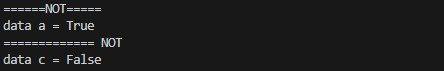
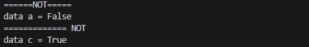
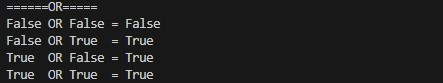
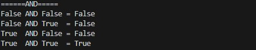
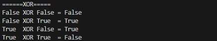

# Pertemuan11 - Operasi Logika atau Boolean (Python Tutorial)

Operasi logika atau boolean akan membahas mengenai 4 operasi yaitu :

- not
- or
- and
- xor

# NOT

Sekarang, kita akan coba sengan operasi logika `not` terlebih dahulu.

```python
print('======NOT=====')

a = True
c = not a
print('data a =', a)
print('============= NOT')
print('data c =', c)
```



Jika dijalankan, maka `c` akan <b>False</b>. Karena terdapat kata `not`. Bagaimana jika kita ubah a menjadi <b>False</b>? Maka hasilnya `c` akan <b>True</b>.

```python
print('======NOT=====')

a = False
c = not a
print('data a =', a)
print('============= NOT')
print('data c =', c)
```



# OR

Untuk `or` akan membandingkan antara variabel satu yang berisi boolean dengan lain dan menghasilkan nilai boolean.

```python
print('======OR=====')

a = False
b = False
c = a or b
print(a,'OR',b,'=',c)

a = False
b = True
c = a or b
print(a,'OR',b,' =',c)

a = True
b = False
c = a or b
print(a,' OR',b,'=',c)

a = True
b = True
c = a or b
print(a,' OR',b,' =',c)
```



Jika dilihat bahwa, jika salah satu bernilai true. Maka hasilnya akan true seperti contoh `true or false` maka hasilnya `true`.

# AND

Untuk `and` sama seperti `or` akan membandingkan variabel boolean dengan yang lain. Namun kebalikan dari `or`, `and` akan menghasilkan nilai kebalikannya.

```python
# AND

print('======AND=====')

a = False
b = False
c = a and b
print(a,'AND',b,'=',c)

a = False
b = True
c = a and b
print(a,'AND',b,' =',c)

a = True
b = False
c = a and b
print(a,' AND',b,'=',c)

a = True
b = True
c = a and b
print(a,' AND',b,' =',c)
```



Maksud dari kebalikannya ya seperti itu. Jika salah satu bernilai false, maka hasilnya akan false. Hal tersebut berbanding terbalik dengan `or`.

# XOR

Operasi `xor` ini bukan operasi boolean melainkan bitwise, namun kita coba sekalian karena fungsi-nya mirip. Operasi `xor` ini hampir mirip dengan `or` namun ada perbedaan yang sangat jelas. Untuk penulisan operasi ini tidak menggunakan tulisan `xor` melainkan simbol `^`.

```python
# XOR

print('======XOR=====')

a = False
b = False
c = a ^ b
print(a,'XOR',b,'=',c)

a = False
b = True
c = a ^ b
print(a,'XOR',b,' =',c)

a = True
b = False
c = a ^ b
print(a,' XOR',b,'=',c)

a = True
b = True
c = a ^ b
print(a,' XOR',b,' =',c)
```



Coba perhatikan, jika salah satu bernilai <b>True</b>, maka hasilnya <b>True</b> bukan? ini sama seperti `or`. Namun lihat lagi bahwa jika nilai nya <b>True</b> semua atau <b>False</b> semua maka hasilnya akan <b>False</b>.

<br>

Cukup sampai situ tentang operasi logika dan boolean.