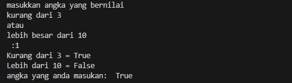
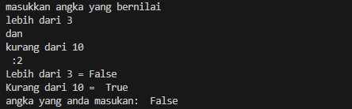
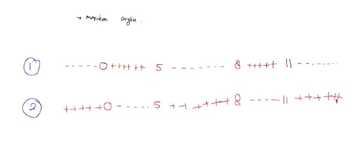

# Pertemuan12 - Latihan Komparasi dan Logika (Python Tutorial)

Latihan untuk menggabungkan area rentang dari angka

# latihan 1

```python
# ++++++3-------10++++++

inputUser = float(input("masukkan angka yang bernilai\nkurang dari 3 \natau \nlebih besar dari 10\n :"))

# +++++3-----------
# Memeriksa angka kurang dari 3

isKurangDari = (inputUser < 3)
print("Kurang dari 3 =", isKurangDari)

# ------------10++++++
# Memeriksa angka lebih dari 10

isLebihDari = (inputUser > 10)
print("Lebih dari 10 =", isLebihDari)

# ++++++3-------10++++++

isCorrect = isKurangDari or isLebihDari
print("angka yang anda masukan: ", isCorrect)
```



# latihan 2

```python
# ---------3+++++++10--------
# kasus irisan
print("\n", 10*"=","\n")

inputUser = float(input("masukkan angka yang bernilai\nlebih dari 3 \ndan \nkurang dari 10\n :"))

# -----3++++++++++++++
# lebih dari 3

isLebihDari = inputUser > 3
print("Lebih dari 3 =", isLebihDari)


# ++++++++++++10------
# kurang dari 10
isKurangDari = inputUser < 10
print("Kurang dari 10 = ", isKurangDari)

# ---------3+++++++10--------

isCorrect = isKurangDari and isLebihDari
print("angka yang anda masukan: ", isCorrect)
```


<br>

# Latihan Soal




1. Soal Pertama

> ------0+++++5-------8+++++11------

```python
# Soal Pertama

inputUser = float(input("Masukkan angka lebih dari 0 dan kurang dari 5 \natau\n lebih dari 8 dan kurang dari 11 :"))

isCondition1 = inputUser > 0 and inputUser < 5
isCondition2 = inputUser > 8 and inputUser < 11
isCorrect = isCondition1 or isCondition2

print("Angka yang anda masukkan = ", isCorrect)
```

2. Soal Kedua

> ++++++0-----5++++++8-----11+++++

```python
# Soal Kedua

inputUser = float(input("Masukkan angka kurang dari 0 atau lebih dari 5 \ndan\n kurang dari 8 atau lebih dari 11 :"))

isCondition1 = inputUser < 0 or inputUser > 5
print(isCondition1)
isCondition2 = inputUser < 8 or inputUser > 11
print(isCondition2)
isCorrect = isCondition1 and isCondition2

print("Angka yang anda masukkan = ", isCorrect)
```

