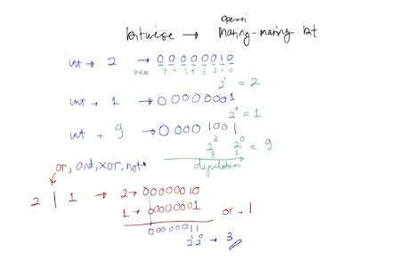
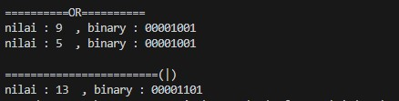
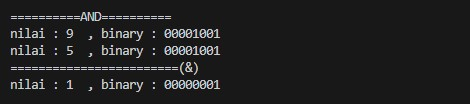
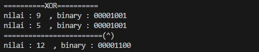
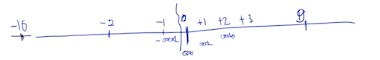
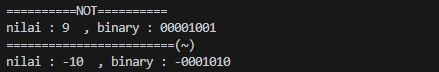
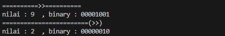

# Pertemuan13 - Operator Bitwise (Python Tutorial)

Operasi bitwise merupakan operasi masing-masing bit. Misalnya, integer diubah menjadi nilai bit.



Jadi bisa dibilang, operator bitwise ini seperti operator logika perbandingan namun hanya saja menggunakan nilai bit.

Sama seperti operator logika, kita gunakan `or`,`and`,`xor`, dan `not`. Sekarang kita coba praktekkan.

# OR (|)

Kita coba menggunakan `or`. Untuk operasi bitwise gunakan simbol `|`.

```python
a = 9
b = 5

# bitwise OR (|)
c = a | b
print("\n==========OR==========")
print("nilai :",a," , binary :", format(a,'08b'))
print("nilai :",b," , binary :", format(a,'08b'))
print("========================(|)")
print("nilai :",c," , binary :", format(c,'08b'))
```



# AND (&)

Kita coba menggunakan `and`. Untuk operasi bitwise gunakan simbol `&`.

```python
a = 9
b = 5

# bitwise AND (&)
c = a & b
print("\n==========AND==========")
print("nilai :",a," , binary :", format(a,'08b'))
print("nilai :",b," , binary :", format(a,'08b'))
print("========================(|)")
print("nilai :",c," , binary :", format(c,'08b'))
```



# XOR (^)

Sebenarnya, `xor` ini merupakan operasi bitwise dan tidak berada pada operasi logika boolean, makanya langsung menggunakan simbol `^` dan tidak `xor`.

```python
a = 9
b = 5

# bitwise XOR (^)
c = a ^ b
print("\n==========XOR==========")
print("nilai :",a," , binary :", format(a,'08b'))
print("nilai :",b," , binary :", format(a,'08b'))
print("========================(^)")
print("nilai :",c," , binary :", format(c,'08b'))
```



# NOT (~)

Untuk `not` ini agak tricky karena bit nya bisa berubah. Kenapa? Karena nilai `0` tidak mempunyai nilai positif atau negatif, jadi untuk mirror-kan nilai positif seperti contoh nilai `9` maka dia akan berubah menjadi `-10`. Berikut contoh gambar-nya.



```python
# bitwise NOT (~)
c = ~a
print("\n==========NOT==========")
print("nilai :",a," , binary :", format(a,'08b'))
print("========================(~)")
print("nilai :",c," , binary :", format(c,'08b'))
```



# Shifting

Shifting digunakan untuk menggeser nilai bit, penggeseran bisa ke kanan dan ke kiri tergantung operator shifting yang dipakai.

## shift right (>>)

Digunakan untuk menggeser nilai bit ke kanan.

```python
# shift right (>>)
c = a >> 2
print("\n==========>>==========")
print("nilai :",a," , binary :", format(a,'08b'))
print("========================(>>)")
print("nilai :",c," , binary :", format(c,'08b'))
```



## shift left (<<)

Digunakan untuk menggeser nilai bit ke kiri.

```python
# shift left (<<)
c = a << 2
print("\n==========<<==========")
print("nilai :",a," , binary :", format(a,'08b'))
print("========================(<<)")
print("nilai :",c," , binary :", format(c,'08b'))
```


<hr>

Oke cukup sampai disitu untuk operator bitwise.