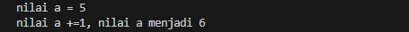
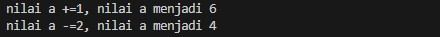
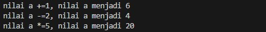
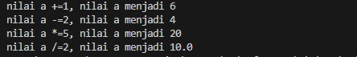
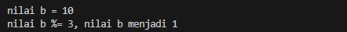
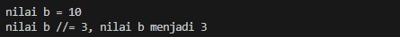
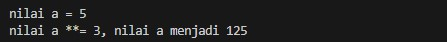
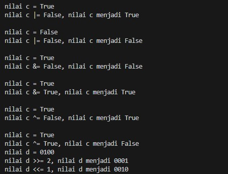

# Pertemuan13 - Operator Assigment (Python Tutorial)

Operator assigment adalah operasi yang dapat dilakukan dengan penyingkatan, operasi akan ditambah dengan assignment.

berikut contoh sederhana

```python
a = 5 # ini adalah assignment
print("nilai a =", a)
```

Sekarang kita coba untuk menjumlahkan nilai `a` dengan angka 1. Cukup mudah.

```python
a = a + 1
print("nilai a =", a)
```

Kode diatas, bisa kita singkat menjadi seperti ini

```python
a +=1
print("nilai a +=1, nilai a menjadi", a)
```

hasilnya akan sama.



Untuk pengurangan bisa juga dipakai, berikut contohnya

```python
a -=2
print("nilai a -=2, nilai a menjadi", a)
```


Mengapa nilai-nya menjadi 4? Karena nilai `a` awalnya 5 terus ditambah 1 menjadi 6 seperti hasil diatas tadi, terus kita minus-kan 2. Maka hasilnya pasti 4.

Sekarang kita coba perkalian, berikut contohnya

```python
a *=5
print("nilai a *=5, nilai a menjadi", a)
```


Hasilnya akan menjadi 20.

Sekarang kita coba pembagian, berikut contohnya

```python
a /=2
print("nilai a /=2, nilai a menjadi", a)
```



<br>

Sekarang kita coba modulus, berikut contohnya

```python
b = 10
print("\nnilai b =",b)

b %= 3
print("nilai b %= 3, nilai b menjadi", b)
```



Sekarang kita coba left divison, berikut contohnya

```python
b = 10
print("\nnilai b =",b)

b //= 3
print("nilai b //= 3, nilai b menjadi", b)
```



Sekarang kita coba pangkatkan, berikut contohnya

```python
a = 5
print("\nnilai a =",a)

a **= 3
print("nilai a **= 3, nilai a menjadi", a)
```



<hr>

Selain itu, kita juga bisa menggunakan operator bitwise.

berikut contohnya

```python
# operator bitwise
# OR
c = True
print("\nnilai c =",c)
c |= False
print("nilai c |= False, nilai c menjadi", c)
c = False
print("\nnilai c =",c)
c |= False
print("nilai c |= False, nilai c menjadi", c)

# OR
c = True
print("\nnilai c =",c)
c &= False
print("nilai c &= False, nilai c menjadi", c)
c = True
print("\nnilai c =",c)
c &= True
print("nilai c &= True, nilai c menjadi", c)

# XOR
c = True
print("\nnilai c =",c)
c ^= False
print("nilai c ^= False, nilai c menjadi", c)
c = True
print("\nnilai c =",c)
c ^= True
print("nilai c ^= True, nilai c menjadi", c)

# Shifting

d = 0b0100
print("nilai d =", format(d, "04b"))
d >>= 2
print("nilai d >>= 2, nilai d menjadi", format(d, '04b'))
d <<= 1
print("nilai d <<= 1, nilai d menjadi", format(d, '04b'))
```

