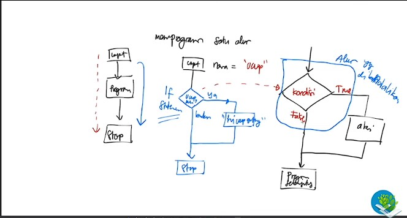
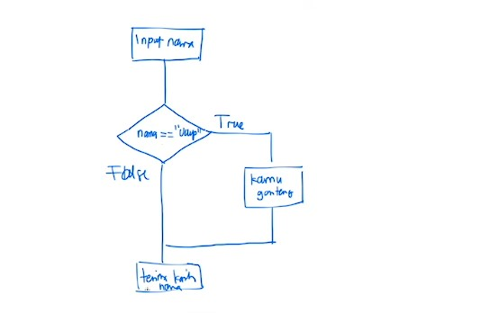
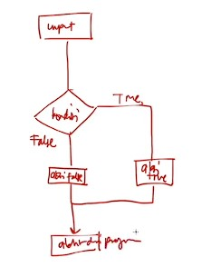

# Pertemuan21 - IF and Else Statment (Python Tutorial)

Sekarang kita akan membahas mengenai If dan Else Statment. Perhatikan gambar berikut :



## Program satu alur

Setiap program itu selalu ada yang nama-nya start->process->end. Dimana start ini merupakan input awalan sebuah program, disusul dengan process yang merupakan kondisi dalam suatu program serta end dimana program akan dihentikan jika kondisi sudah terpenuhi.

Simple-nya terdapat 3 langkah untuk if statment

1. if nya
2. kondisinya
3. aksinya

## IF Statment



Kita akan mencoba membuat if dengan gambar seperti diatas ini. Jadi pertama kita akan membuat input nama terlebih dahulu. Kondisi-nya kita buat jika ada nama-nya ucup maka dia akan menuliskan kalimat "kamu ganteng" jika tidak ada maka tulis "terima kasih nama"

berikut contoh penerapan-nya

```python
nama = input("Siapa nama anda? : ")

if nama=="ucup" : print("Kamu Ganteng abieezz!!!")
print(f"Terima kasih {nama}")
```

If statment yang digunakan pada kode diatas merupakan program if inline, dimana aksi-nya hanya sedikit atau cuma satu saja. Jika ingin aksi-nya banyak seperti print 3x didalam if, maka kita perlu menggunakan if indentation. Berikut contoh penerapan-nya

```python
if nama=="ucup":
    print("Kamu ganteng abieeez!")
    print("kamu juga keren banget!")
print(f"Terima kasih {nama}")
```

if statment pada python berbeda dari bahasa pemrograman lain, dimana dibahasa lain pasti menggunakan kurung kurawal atau hal lain. Python cukup mudah dan menggunakan spasi pada aksi-nya. Seperti contoh kode di atas dimana

- `print("Kamu ganteng abieeez!")`
- `print("kamu juga keren banget!")`

menjorok ke dalam.

Sedangkan
- `print(f"Terima kasih {nama}")`

merupakan akhir dari program-nya.

## ELSE Statment



Perhatikan flowchart diatas, kita akan membuat if else statment sesuai flowchart diatas. Berikut contoh penerapan-nya

```python
if nama =="otong":
    print("hai otooong, si keren!!!")
else:
    print("Ah kamu bukang Otong, kamu gak keren!")

print("akhir dari program")
```