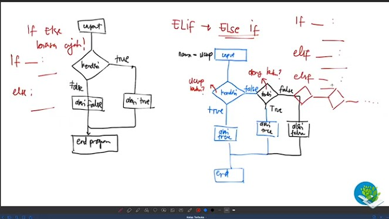

# Pertemuan22 - Elif Statment (Python Tutorial)

Sekarang, kita akan mencoba elif statment. Elif dapat digunakan jika suatu if memiliki banyak kondisi bercabang. Perhatikan gambar berikut :



Tulisan disebelah kiri itu menunjukan if else biasa, sedangkan tulisan disebelah kanan itu menunjukan kegunaan dari Elif (Else If).

Jika dilihat, terdapat beberapa percabangan pada kondisi elif. Sebagai contoh :

1. Input nama
2. Kondisi 1 : apakah nama-nya ucup? Jika ya maka lakukan aksi 1
3. Kondisi 2 : apakah nama-nya otong? Jika ya maka lakukan aksi 2.
4. Akhir dari program

Jadi bisa dipastikan dengan Elif, kita dapat membuat kondisi yang banyak pada suatu percabangan.

Sekarang kita coba buat kodingan-nya. Perhatikan code berikut ini :

```python
nama = input("Nama kamu siapa? ")

if nama == "ucup": # kondisi 1
    print("Hai ganteeeeng beuds!") # aksi true 1
elif nama == "otong": # kondisi 2
    print("Hai si kece bangeeets!!") # aksi true 2
elif nama == "mario": # kondisi 3
    print("Hai humooreeesh!") # aksi true 3
else:
    print("au ah gak kenal!!!") # aksi false
print("ini adalah akhir dari program")
```

Kode diatas merupakan salah satu contoh penggunaan Elif. Terdapat 3 kondisi dimana jika masing-masing kondisi terpenuhi maka aksi akan dijalankan, jika tidak maka akan langsung ke akhir program.