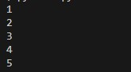
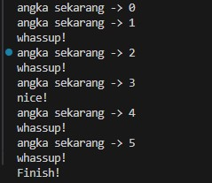

# Pertemuan26 - Continue and Pass (Python Tutorial)

Sekarang, kita akan mencoba membuat Continue dan Pass pada sebuah while loop.

## Pass

Sebelum masuk ke Continue, kita buat dulu Pass karena ini sangat mudah dipahami. Pass berfungsi sebagai dummy, yang artinya jika ada suatu kode atau fungsi diberi Pass, maka tidak akan dieksekusi.

Hal itu mirip seperti komentar, dimana kode tidak akan dieksekusi jika terdapat komentar pada kode tersebut. Berikut contoh penerapan-nya.

```python
angka = 0

while angka < 5:
    angka += 1

    if angka == 3:
        pass # ini tidak akan dieksekusi

    print(angka)
```



Hasilnya akan tetap sama seperti gambar diatas, tidak akan ada perubahan apapun jika terdapat Pass pada kode tersebut.

## Continue

Continue fungsi-nya melewati aksi selanjutnya atau masuk ke dalam step selanjutnya. Apapun kode yang terdapat continue, maka dia akan skip aksi-nya. Berikut contoh penerapan-nya.

```python
angka = 0

print(f"angka sekarang -> {angka}")

while angka < 5:
    angka += 1

    print(f"angka sekarang -> {angka}")

    if angka == 3:
        print("nice!")
        continue # akan membuat loop meloncat ke step selanjutnya
    print("whassup!")

print("Finish!")
```



Coba perhatikan print yang terdapat pada while. Ada 2 print yang kita definisikan pada while tersebut bukan? pertama adalah `f"angka sekarang -> {angka}"` dan kedua adalah `whassup!`. Kita perhatikan pada kata `whassup!` saja.

Sekarang, kita lihat apa yang terjadi pada angka ke-3 setelah kita kasih continue? Hasilnya, dia akan skip tulisan `whassup!` dan hanya menampilkan tulisan `nice!` lalu lanjut ke perhitungan selanjutnya.

Inilah fungsi dari Continue. Dimana kode yang terdapat fungsi tersebut, maka dia akan mengabaikan perintah selanjutnya lalu masuk ke perintah awal dan seterus-nya.