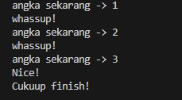

# Pertemuan27 - Break (Python Tutorial)

Sekarang kita coba fungsi Break. Sebelumnya, kita sudah mencoba fungsi Continue dimana setiap kode yang ada Continue, maka dia akan lanjut ke step berikut-nya dan tidak eksekusi kode dibawahnya.

Berbeda dengan Continue, setiap kode yang ada Break-nya. Maka hal itu akan menghentikan proses-nya seketika. Jadi program nya langsung selesai. Berikut contoh penerapan-nya.

```Python
while angka < 5:
    angka += 1
    print(f"angka sekarang -> {angka}")

    if angka == 3:
        print("Nice!")
        break
    print("whassup!")

print("Cukuup finish!")
```



Terlihat pada gambar diatas, angka setelah 3 tidak akan di eksekusi dan program langsung selesai. Inilah fungsi dari Break. 

Break digunakan untuk apa ketika diimplementasikan ke project sebenarnya? Biasanya, Break digunakan untuk pencarian suatu item. Untuk melakukan pencarian, harus menggunakan looping dan jika sudah ketemu, maka looping tersebut harus dihentikan menggunakan Break.

<hr/>

Sekarang kita coba buat sesuatu yang menarik, kita tambahkan input user dan hitung angka sampai berapa gitu menggunakan while dan break ini. Berikut contoh penerapan-nya

```python
data_int = int(input("Hitung angka sampai ke = ").replace("-", ""))

angka = 0

while True:
    angka += 1
    print(f"Count -> {angka}")
    print(f"angka sekarang -> {angka}")

    if angka == data_int:
        print("Nice!")
        break

print("Cukup Finish!")
```

Kita buat dulu user input-nya, abaikan fungsi `replace()`. Mengapa kita ubah menjadi While True? karena jika benar maka program akan tetap jalan.

Lanjut, buat sama seperti sebelum-nya. 