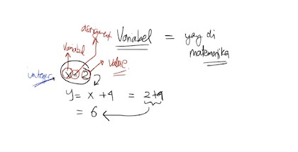

# Pertemuan4 - Variabel (Python Tutorial)

Variabel adalah tempat penyimpanan data. Pembuatan Variabel pada program python cukup mudah, dengan cara mendefinisikan variabel nya terlebih dahulu dengan nama yang telah ditentukan sendiri dan diisi dengan nilai variable nya.

Sebelum menulis, kita bisa langsung mencoba-nya ke dalam terminal di VS Code. Cara membuka terminal di VS Code cukup mudah dengan cara tekan tombol <b>CTRL + `</b>.

Variable sama seperti yang ada di matematika.



- `X` adalah variabel.
- `=` adalah assigment
- `2` adalah value/ nilai variabel.

Di python, kita tidak perlu pusing menuliskan tipe data pada variabel nya karena python akan menyesuaikan tipe data sesuai value yang di isi.

```python
a = 10
x = 5
panjang = 1000

print("Nilai a =", a)
print("Nilai x =", x)
print("Nilai panjang =", panjang)
```

Di python tidak ada deklarasi. Deklarasi hanya digunakan untuk menentukan tipe data, sedangkan python tidak perlu menuliskan tipe data maak deklarasi tidak dubutuhkan.

## Penamaan Variabel

Untuk menamai Variabel memiliki aturan tertentu yang harus diperhatikan. Kita bisa menulis variabel apapun asalkan jangan menamai variabel sebagai berikut :

- nilai y = 15 :x:
- nilai_y = 15 :heavy_check_mark:

- 1juta = 1000000 :x:
- juta1 = 1000000 :heavy_check_mark:

- nilaiZ = 17.5 :heavy_check_mark:

<br>

Setelah kita memanggil nilai tersebut, apakah bisa dipanggil lagi? bisa. Bagaimana dengan mengganti nilai? bisa.

Semisal, kita ganti nilai `a` yang awalnya 10 menjadi 7, bisa dilakukan dengan cara membuat variabel `a` lagi.

```python
a = 7
print("Nilai a =", a)
```

Jika dijalankan, maka nilai `a` akan berubah. Misalkan lagi, kita coba buat nilai b berisi nilai a. Hal ini bisa dilakukan dan namanya adalah assignment indirect.

```python
b = a
print("Nilai b =", b)
```

Jadi seperti itu untuk variabel pada Python.