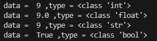
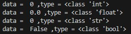
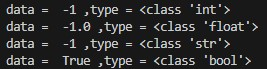
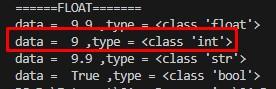
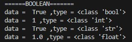
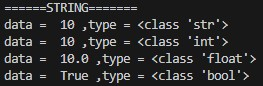
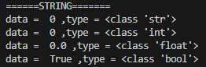
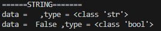

# Pertemuan6 - Casting Tipe Data (Python Tutorial)

Casting tipe data merupakan sebuah metode untuk ubah tipe data satu ke tipe data yang lain. Hal ini bisa dilakukan di Python.

## Integer

Dengan casting ini, kita hanya perlu merubah tipe data tanpa mengganti isi-nya. Jadi misalkan, kita memiliki data integer dengan isian angka bulat yaitu `9`, nah kita pengen tuh ubah integer menjadi float tanpa menhilangkan angka-nya. Dengan casting maka dapat dilakukan.

berikut contoh penerapan-nya

```python
print("======INTEGER=======")
## INTEGER
data_int = 9
print("data = ", data_int, ",type =", type(data_int))

data_float = float(data_int)
print("data = ", data_float, ",type =", type(data_float))
```

Bagaimana dengan tipe data lain? jawabannya bisa, semua tipe data dapat diubah dengan casting ini. Berikut contoh lengkapnya.

```python
data_float = float(data_int)
data_str = str(data_int)
data_bool = bool(data_int)

print("data = ", data_float, ",type =", type(data_float))
print("data = ", data_str, ",type =", type(data_str))
print("data = ", data_bool, ",type =", type(data_bool))
```

Jika dijalankan, maka hasilnya akan seperti gambar dibawah ini
.

<br>

Hal menarik jika kita mengubah tipe data integer menjadi boolean maka akan bernilai True. Kenapa bisa terjadi? Karena angka nya lebih dari `0`. Bagaimana jika kita ubah `data_int = 0`? Apa hasilnya?

```python
data_int = 0
```



Hasilnya bool akan menjadi <b>False</b>. Karena Boolean hanya bernilai <b>True</b> dan <b>False</b> itu sama saja dengan nilai 1 dan 0.

Kita coba lagi, bagaimana dengan nilai `-1`?

```python
data_int = -1
```



Hasilnya akan <b>True</b>, mengapa bisa seperti itu? Karena nilai <b>False</b> hanya berpatokan pada angka `0` saja, Meskipun angka tersebut minus namun selagi angka tersebut lebih besar dari `0` maka dianggap <b>True</b>.

## Float

Oke, sekarang kita akan coba ubah data float menjadi tipe data lain, tadi kan sudah mencoba data integer diubah menjadi tipe data lain. Sekarang kita coba yang float.

```python
## FLOAT
print("======FLOAT=======")
data_float = 9.5
print("data = ", data_float, ",type =", type(data_float))

data_int = int(data_float)
data_str = str(data_float)
data_bool = bool(data_float)

print("data = ", data_int, ",type =", type(data_int))
print("data = ", data_str, ",type =", type(data_str))
print("data = ", data_bool, ",type =", type(data_bool))
```

Hasilnya seperti itu, ada yang menarik juga mengenai Float dan Integer ini. Bagaimana jika nilai float menjadi `9.9`? Apakah integer akan dibulatkan menjadi `10` atau `9`?

```python
data_float = 9.9
```



Hasilnya adalah `9`. Jadi akan dibulatkan ke bawah bukan ke atas.


## Boolean

Selanjutnya, kita coba ubah boolean menjadi tipe data lain dan hasilnya akan seperti apa nantinya.

```python
## BOOLEAN
print("======BOOLEAN=======")
data_bool = True
print("data = ", data_bool, ",type =", type(data_bool))

data_int = int(data_bool)
data_str = str(data_bool)
data_float = float(data_bool)

print("data = ", data_int, ",type =", type(data_int))
print("data = ", data_str, ",type =", type(data_str))
print("data = ", data_float, ",type =", type(data_float))
```



## String

Sekarang kita coba untuk mengubah tipe data String menjadi tipe data lain.

Perlu diperhatikan bahwa string merupakan sekumpulan karakter atau tulisan bisa berupa huruf dan angka. Jika mengubah huruf ke tipe data integer (angka) maka akan error karena tidak bisa. Untuk hal ini, kita akan coba pakai string dengan tulisan angka saja.

```python
## STRING
print("======STRING=======")
data_str = "10"
print("data = ", data_str, ",type =", type(data_str))

data_int = int(data_str)
data_float = float(data_str)
data_bool = bool(data_str)

print("data = ", data_int, ",type =", type(data_int))
print("data = ", data_float, ",type =", type(data_float))
print("data = ", data_bool, ",type =", type(data_bool))
```



Ada satu hal menarik yang perlu kita coba nih, Kalau kita coba ubah tulisan `10` menjadi `0` pada tipe data string. Maka boolean akan menjadi <b>True</b> atau <b>False</b>?

```python
data_str = "0"
```



Hasilnya akan tetap menjadi <b>True</b>. Kenapa bisa terjadi? Karena Boolean melihat itu tipe data string bukanlah integer. Jadi bagaimana jika itu menjadi <b>False</b>? Bisa dengan cara memberikan nilai kosong ke string-nya.

```python
data_str = ""
```



<br>

Cukup segitu pembahasan mengenai Casting Tipe Data pada Python.