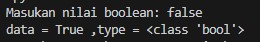
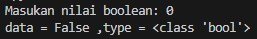

# Pertemuan7 - Input Data (Python Tutorial)

Sekarang, kita akan mencoba mengambil input data dari user yaitu yang mengetikkan informasinya adalah kita sendiri.

```python
data = input("Masukan data: ")

print("data =", data, ",type =", type(data))
```

Semua data yang dimasukkan melalui fungsi `input()` berupa tipe data string. Nah, jika kita ingin mengambil integer maka kita perlu casting tipe data tersebut.

```python
angka = int(input("Masukan angka: "))

print("data =", angka, ",type =", type(angka))
```

## Bagaimana dengan Boolean?

Nah boolean ini harus di casting ke tipe data integer terlebih dahulu sebelum memberikan nilai-nya. Mengapa? Karena apapun nilai yang dimasukkan ke input-nya akan menghasilkan nilai <b>True</b>.



```python
biner = bool(int(input("Masukan nilai boolean: ")))

print("data =", biner, ",type =", type(biner))
```



<br>

Oke, cukup segitu untuk input data pada python.