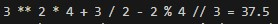
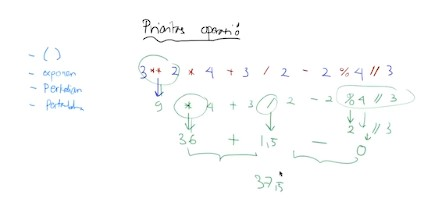

# Pertemuan8 - Operasi Aritmatika (Tutorial Python)

Berbicara tentang pemrograman, pastinya tidak terlepas dari operasi aritmatika.


## Tambah (+)

Operasi yang bisa digunakan adalah tambah seperti halnya penjumlahan pada matematika.

```python
a = 10
b = 3

# operasi tambah +
hasil = a + b
print(a, '+', b, '=', hasil)
```

## Kurang (-)

Operasi yang bisa digunakan adalah kurang seperti halnya pengurangan pada matematika.

```python
a = 10
b = 3

# operasi pengurangan -
hasil = a - b
print(a, '-', b, '=', hasil)
```

## Kali (*)

Operasi yang bisa digunakan adalah kali seperti halnya perkalian pada matematika.

```python
a = 10
b = 3

# operasi perkalian *
hasil = a * b
print(a, '*', b, '=', hasil)
```

## Bagi (/)

Operasi yang bisa digunakan adalah bagi seperti halnya pembagian pada matematika.

```python
a = 10
b = 3

# operasi pembagian /
hasil = a / b
print(a, '/', b, '=', hasil)
```

<br>

Ada beberapa operator yang tidak ada di bahasa pemrograman lain seperti exponen.

## Eksponen (**)

Eksponen merupakan operator untuk memberikan pangkat pada bilangan. Jika dimatematika, ini disebut bilangan berpangkat.

```python
a = 10
b = 3

# operasi eksponen (pangkat) **
hasil = a ** b
print(a, '**', b, '=', hasil)
```

## modulus (%)

Operator modulus digunakan untuk sisa pembagian.

```python
a = 10
b = 3

# operasi modulus %
hasil = a % b
print(a, '%', b, '=', hasil)
```

## floor division (//)

Operator floor divison merupakan kebalikan dari modulus, atau bisa digunakan jika ingin pembulatan bagi. Biasanya hasil bagi akan ada koma, untuk membulatkan bisa gunakan operator ini.

```python
a = 10
b = 3

# operasi floor division //
hasil = a // b
print(a, '//', b, '=', hasil)
```

## Prioritas operasi

Prioratis operasi merupakan hal yang perlu diperhatikan karena setiap operator memiliki nilai prioritas. Misalkan, jika ada operator (+) dan (*) didalam bilangan, maka yang diitung terlebih dahulu sudah pasti (*). Sama halnya dengan matematika.

```python
x = 3
y = 2
z = 4

hasil = x ** y * z + x / y - y % z // x
print(x, '**' ,y, '*' ,z, '+' ,x, '/' ,y, '-' ,y, '%' ,z, '//' ,x, '=',hasil)
```



Hasilnya menjadi `37.5`. Darimana angkat tersebut bisa tercipta? Jawabannya adalah prioritas operasi.

berikut urutan prioritas operasi

- `()` Kurung
- `**` Eksponen
- `*` Perkalian
- `/` Pembagian
- `%` Modulus
- `//` Floor Division
- `+` Pertambahan
- `-` Pengurangan



Sekarang kita coba kesaktian tanda kurung pada operasi bilangan-nya.

```python
# Tidak ada tanda Kurung
hasil = x + y * z
print(x, '+' ,y, '*' ,x, '=',hasil) # 11

# Ada tanda kurung
hasil = (x + y) * z
print('(' ,x, '+' ,y,')', '*' ,x, '=',hasil) # 20
```

Oke cukup segitu untuk operasi aritmatika pada Python.